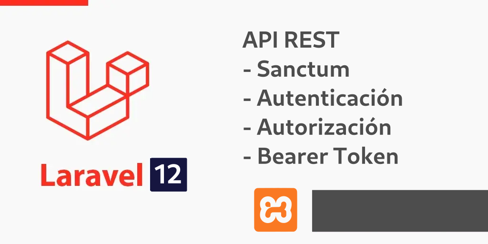
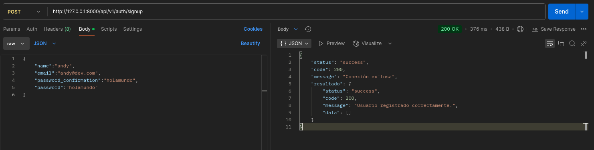
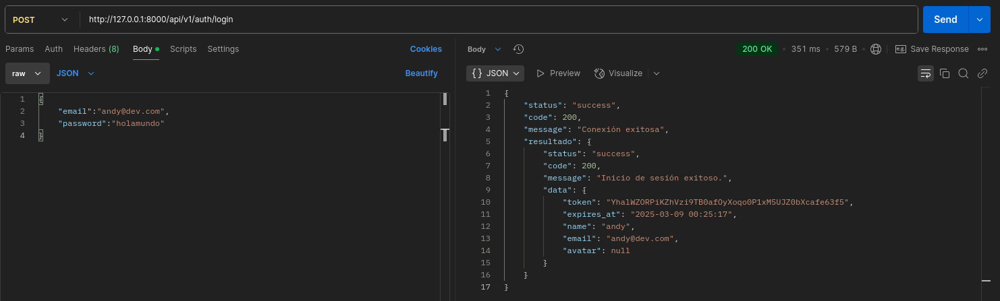
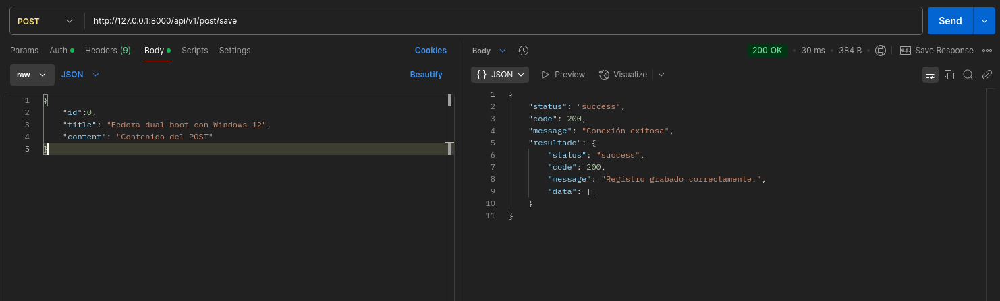
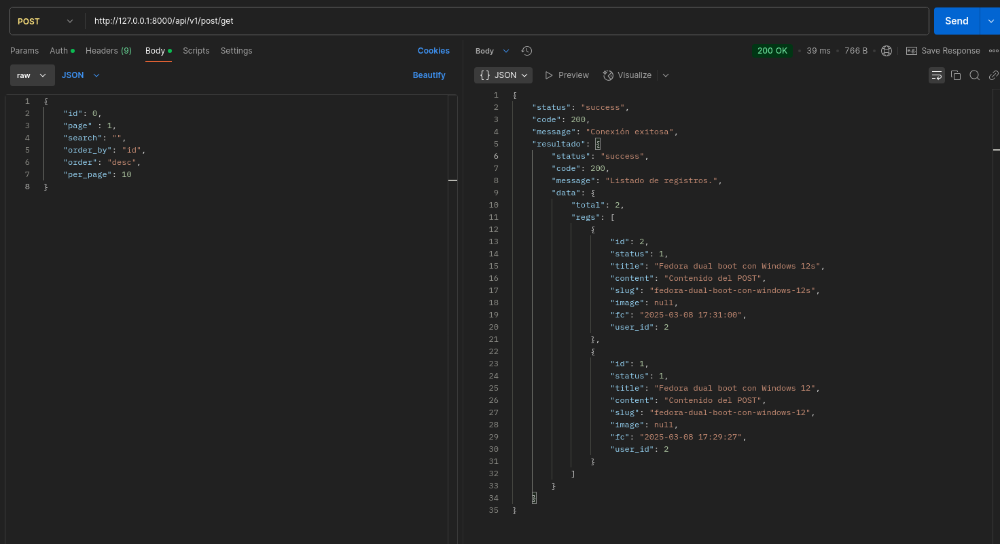

# API REST Laravel 12 Sanctum



# Contexto

Laravel Sanctum es una API paquete de autenticación para Laravel las aplicaciones, proporcionando un peso ligero, sencillo de usar un sistema de autenticación para una sola página de aplicaciones (SPAs), aplicaciones para móviles, y otras API. Ofrece token de autenticación basada en el uso de JSON Web de Tokens (JWT) o API tokens, la habilitación de la autenticación segura sin la sobrecarga de sesión tradicional basado en la autenticación. Sanctum simplifica la configuración de token de autenticación, permitiendo a los desarrolladores centrarse en la construcción de sus aplicaciones en lugar de lidiar con la autenticación de complejidades.

En este ejemplo se usará Sanctum, para autenticación y autorización con token bearer en las peticiones a endpoints.


Para replicar el proyecto manualmente se puede revisar el tutorial <https://blog.linuxitos.com/post/api-rest-laravel-12-sanctum-autenticacion-autorizacion-bearer>

## Funcionalidades

- Login
- Registro
- Lgout
- Bearer token
- Post (Consulta, busqueda, filtro, paginación, ordenamiento, editar y agregado)
- Actualización perfil
- Actualización contraseña

## Requerimientos

- PHP > 8.2
- Composer
- GIT (opcional)
- XAMPP > 8.2 ó PHP nativo > 8.2
- MariaDB o MySQL por separado
- SO el que soporte dichos requerimientos

# Implementación Clonar Repositorio

- Clonar el proyecto en la ruta de lampp/htdocs/ o ubicarlo en el directorio en donde se requiera ejecutar:

```
git git@gitlab.com:linuxitos/api-rest-laravel-12-sanctum.git
```

Remombrar el proyecto clonado a `apidash` 

- Ejecutar composer install

```
composer install
```

- Si se usa XAMPP crear la base de datos con nombre **ApiDashExample**
- Cambiar el nombre del archivo bk.env => .env
- Configurar los datos de la base de datos

```
DB_CONNECTION=mysql
DB_HOST=127.0.0.1
DB_PORT=3306
DB_DATABASE=ApiDashExample
DB_USERNAME=root
DB_PASSWORD=
```

- Ejecutar migraciones de base de datos desde laravel

Para ésto, entrar al directorio del proyecto, y ejecutar los siguientes comandos:

```
php artisan migrate:fresh --seed
```

- Para iniciar el proyecto

```
php artisan serve
```


# Pruebas

## Registro

```
URL http://127.0.0.1:8000/api/v1/auth/signup
Método: POST
Body:

{
	"name":"andy",
	"email":"andy@dev.com",
	"password_confirmation":"holamundo",
	"password":"holamundo"
}
```

Resulado



## Login

```
URL http://127.0.0.1:8000/api/v1/auth/login
Método: POST
Body:

{
	"email":"andy@dev.com",
	"password":"holamundo"
}
```

Resultado:



## Registro Post

- id: si el id es igual a 0, entonces se creará un nuevo registro, si el id es mayor a 0, se actualizará la información del id que corresponda.

```
URL http://127.0.0.1:8000/api/v1/post/save
Método: POST
Body:

{
	"id":0,
	"title": "Fedora dual boot con Windows 12",
	"content": "Contenido del POST"
}
```

Resultado:



## Listar Post

- id: si se envía 0, se listarán todas los registros que coincidan con la búsqueda, con el filtros, el ordenado, y la paginación, si es mayor a cero, se obtendrá un sólo registro con dicho ID, siempre y cuando exista.
- page: Es el número de la paginación y sólo se respeta si el di es 0
- search: lleva la búsqueda o filtro que se realiza del title y content
- order_by: se ordena de acuerdo al campo que lleve, puede ser cualquiera, y se usa en ordenamiento en tablas
- order: puede ser asc o desc
- per_page: es el total de registro a mostrar en una página

```
URL http://127.0.0.1:8000/api/v1/post/get
Método: POST
Body:

{
    "id": 0,
    "page" : 1,
    "search": "",
    "order_by": "id",
    "order": "desc",
    "per_page": 10
}
```

Resultado:



## MIT License

License: MIT

[](https://opensource.org/licenses/MIT)

#### Developed By
----------------
 * linuxitos - <contact@linuxitos.com>